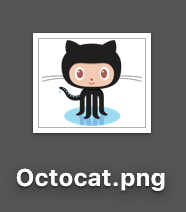

You can use markdown to add content to you webpage.

Here are some highlights of markdown syntax.

# Adding a custom H1
## and an H2
Demo paragraph with words and words and words and words and words and words and words and words and words and words and words and words and words and words and *words* and words and words and words and words and words and words and words and words and words and words and **words**.

Then came the list
* Item 0
* Item 0
  * Item 0
  * Item 0
* Item 0

# Heading 1
## Heading 2
### Heading 3

**bold**
*italics*

1. List Item 1
2. List Item 2

* Bullet 1
* Bullet 2
* Bullet 3

[This is a link](https://google.com)

Here is an image. Don't forget some alt text for better accessibility!

Here is another image who need alt text. 

